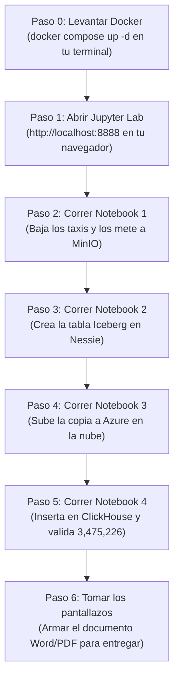

# ¿CÓMO FUNCIONAN LAS HERRAMIENTAS Y QUÉ TIENES QUE HACER EN CADA UNA?
## Guía Práctica y Visual para Alejandro y su Grupo (Proyecto 1 - Big Data)

> **Regla de oro de este proyecto:**
> Tú **NO** tienes que volverte loco abriendo 5 programas diferentes ni configurando pantallas raras. 
> **Tu único centro de mando para ejecutar el trabajo es Jupyter Lab** (en tu navegador en `http://localhost:8888`). Desde allí corres el código Python que le da órdenes a todas las demás herramientas.
> Las demás herramientas son **servidores de fondo que tienen páginas web** a las que tú solo entras a **mirar que todo haya quedado bien y tomar los pantallazos del informe**.

---

## 1. Desmitificando las Herramientas: ¿Qué es cada cosa y qué se hace ahí?

---

### 🪣 1. MinIO ("El Minion")
* **¿Qué es físicamente?** 
  Es un servidor que corre dentro de Docker imitando a Amazon Web Services S3. Tiene una **página web gráfica (interfaz)** muy parecida a Google Drive o Dropbox.
* **¿Tiene interfaz visual?** 
  **SÍ.** Abres tu navegador y entras a: `http://localhost:9001`
  - **Usuario:** `admin`
  - **Contraseña:** `password`
* **¿Qué tienes que hacer ahí?**
  1. No tienes que crear nada a mano porque nuestro `docker-compose.yml` ya le ordena crear dos buckets llamados `taxis` y `warehouse`.
  2. Entras a esa página después de correr el Notebook 1 y el Notebook 2.
  3. Le das clic al bucket `taxis` y verás el archivo `.parquet` que descargamos de internet (**Capa Bronze**).
  4. Le das clic al bucket `warehouse` y verás las carpetas `data/` y `metadata/` de Apache Iceberg (**Capa Silver**).
* **¿Qué pantallazo se saca de aquí para el profe?**
  Una captura de pantalla de la interfaz web de MinIO donde se vean los dos buckets creados y los archivos `.parquet` adentro.

---

### 🧊 2. Apache Iceberg
* **¿Qué es físicamente?** 
  **NO es un programa ni tiene interfaz visual.** Es una **especificación / librería de código** (un formato de tabla).
  En palabras simples: en vez de dejar archivos `.parquet` botados en carpetas desordenadas, Iceberg crea archivos especiales de metadatos (llamados `metadata.json` y manifiestos `.avro`) que le dicen a los motores: *"Estos 5 archivos parquet forman la tabla de taxis, y el estado actual es la versión 1"*.
* **¿Qué tienes que hacer tú con Iceberg?**
  Nada en una interfaz. Todo lo hace la librería `pyiceberg` dentro del **Notebook 2**. Cuando ejecutas el código en Jupyter, Python se encarga de crear la tabla y estructurar los archivos en MinIO.
* **¿Cómo sabes que funcionó?**
  Porque al final del Notebook 2, Python te imprime: `total filas en la tabla iceberg: 3,475,226` y en MinIO aparece la carpeta `metadata/`.

---

### 🧭 3. Project Nessie ("Messi")
* **¿Qué es físicamente?** 
  Es un **servidor de catálogo**. Si Iceberg es el libro con los datos, Nessie es el bibliotecario que anota en una libreta en qué estante está la última versión del libro. Se le conoce como el *"Git para Data Lakes"* porque maneja ramas (`main`), commits y tags de datos.
* **¿Tiene interfaz visual?** 
  Tiene un endpoint tipo API REST en: `http://localhost:19120/api/v1/config`
  Si abres ese link en tu navegador, te muestra un texto en formato JSON diciendo que el servidor está prendido y listo.
* **¿Qué tienes que hacer tú ahí?**
  Tú no tienes que configurar nada en Nessie a mano. En el **Notebook 2**, Python le dice a Nessie: *"Oye Nessie, créame el namespace `demo` y anota ahí la tabla `taxis_iceberg`"*.
* **¿Qué pantallazo se saca de aquí para el profe?**
  El profe pide: *"Catálogo de Nessie con el namespace creado"*.
  Esto lo demuestras de dos formas súper fáciles:
  1. Con el pantallazo de la celda del Notebook 2 donde se ejecuta `catalog.list_namespaces()` y sale en pantalla: `[('demo',)]`.
  2. O abriendo en el navegador la URL de la API de Nessie mostrando los namespaces.

---

### ☁️ 4. Azure Data Lake Storage (ADLS Gen2)
* **¿Qué es físicamente?** 
  Es la nube real de Microsoft Azure. El profesor tiene una cuenta institucional donde nos creó una carpeta compartida:
  `abfss://clase-4-dlt@fhbd.dfs.core.windows.net/GRUPO_X`
* **¿Es un programa que debas instalar?** 
  **NO.** Es un almacenamiento remoto en los centros de datos de Microsoft.
* **¿Qué tienes que hacer tú ahí?**
  1. En el archivo `.dlt/secrets.toml`, cambias `GRUPO_X` por el nombre de tu grupo (ejemplo: `grupo_03`).
  2. Abres el **Notebook 3 (`03_minio_to_azure.ipynb`)** y le das correr a las celdas.
  3. DLT se conecta por internet a Azure con la clave que nos dio el profesor y sube los archivos Parquet.
* **¿Qué pantallazo se saca de aquí para el profe?**
  El resultado de la ejecución del Notebook 3 donde DLT imprime en pantalla:
  `Pipeline s3_to_adls load step completed` y `destination used abfss://clase-4-dlt@fhbd.dfs.core.windows.net/GRUPO_X`.
  *(En el Notebook 3 también agregaremos una celda de verificación que lee la carpeta en Azure para listar el archivo subido y tomarle foto).*

---

### ⚡ 5. ClickHouse ("Clickhaus")
* **¿Qué es físicamente?** 
  Es un **Data Warehouse analítico** columnar ultrarrápido. Está pensado para que si una tabla tiene 50 millones de filas, tú puedas hacer un conteo o un promedio y te responda en 0.05 segundos.
* **¿Tiene interfaz visual?** 
  **SÍ.** Tiene una consola web interactiva para escribir consultas SQL llamada **ClickHouse Play / Web Client**.
  La abres en tu navegador en: `http://localhost:8123/play`
* **¿Qué tienes que hacer tú ahí?**
  1. En el **Notebook 4**, corres las celdas para que DLT inserte los 3.4 millones de filas en ClickHouse.
  2. Luego puedes ir a tu navegador a `http://localhost:8123/play` y escribir esta consulta SQL:
     ```sql
     SELECT count(*) FROM default.taxis_iceberg;
     ```
     Le das al botón **Run** (o `Ctrl + Enter`) y vas a ver el número mágico: **`3475226`**.
  3. También escribes:
     ```sql
     SHOW TABLES FROM default;
     ```
* **¿Qué pantallazo se saca de aquí para el profe?**
  El pantallazo de ClickHouse Play mostrando el número `3,475,226` y las tablas de metadatos. ¡Este es el pantallazo que vale el 5.0!

---

## 2. Tu Rol en el Proyecto: ¿Qué haces tú exactamente?

Tú eres el **operador del pipeline**. Tu trabajo práctico consiste en:



---

## 3. Checklist de lo que debe salir en cada Notebook

### En el Notebook 1 (`01_http_to_bucket.ipynb`):
* **Qué haces:** Le das al botón `▶` (Run) para ejecutar las celdas.
* **Qué debe salir en pantalla:**
  ```text
  descargando y leyendo parquet desde: https://...
  total de registros leidos: 3,475,226
  === reporte de carga al minion ===
  Pipeline parquet_to_minio load step completed...
  1 load package(s) were loaded to destination filesystem and into dataset taxis_parquet
  ```
* **Comprobación visual:** Abres `http://localhost:9001` (MinIO), entras al bucket `taxis` y ves el archivo guardado.

---

### En el Notebook 2 (`02_parquet_to_iceberg.ipynb`):
* **Qué haces:** Corres las celdas en orden.
* **Qué debe salir en pantalla:**
  ```text
  archivos parquet encontrados en el minion: ['taxis/...']
  leyendo datos con pyarrow...
  total filas leidas: 3,475,226 | columnas: 19
  namespace demo creado en messi
  namespaces en el catalogo: [('demo',)]
  datos cargados a la tabla iceberg melo
  total filas en la tabla iceberg (demo.taxis_iceberg): 3,475,226
  ```
* **Comprobación visual:** En MinIO (`http://localhost:9001`), vas al bucket `warehouse` y verás la carpeta `demo.db/taxis_iceberg/` con sus subcarpetas `data/` y `metadata/`.

---

### En el Notebook 3 (`03_minio_to_azure.ipynb`):
* **Qué haces:** Corres las celdas para sincronizar con la nube de Azure del profesor.
* **Qué debe salir en pantalla:**
  ```text
  subiendo datos a azure data lake...
  === reporte de carga a azure ===
  Pipeline s3_to_adls load step completed...
  destination used abfss://clase-4-dlt@fhbd.dfs.core.windows.net/GRUPO_X
  Normalized data for the following tables:
  - df_parquet: 3,475,226 row(s)
  ```

---

### En el Notebook 4 (`04_minio_to_clickhouse.ipynb`):
* **Qué haces:** Corres las celdas que transmiten los datos a ClickHouse y hacen la aserción final.
* **Qué debe salir en pantalla:**
  ```text
  filas sacadas de iceberg: 3,475,226
  insertando los datos en clickhaus...
  === reporte de carga a clickhaus ===
  =======================================================
    total de registros en clickhaus: 3,475,226
  =======================================================
  salio melo: la cantidad coincide exactamente con las 3,475,226 filas
  tablas creadas en clickhaus:
   - taxis_iceberg
  ```
* **Comprobación visual:** Abres `http://localhost:8123/play`, ejecutas `SELECT count(*) FROM default.taxis_iceberg` y ves el número `3475226`.

---

## 4. Lista de Pantallazos que te pide el Profe para el informe final

Cuando termines de correr los 4 notebooks, abres un documento Word y pegas estos pantallazos:

1. **Docker Desktop:** Captura de Docker donde se vean los 4 contenedores (`jupyter_workspace`, `minio_lakehouse`, `nessie_catalog`, `clickhouse_olap`) corriendo en verde.
2. **MinIO (Consola Web):** Captura de `localhost:9001` mostrando el bucket `taxis` con su archivo parquet y el bucket `warehouse` con la carpeta de Iceberg.
3. **Nessie (Catálogo):** Captura de la celda de Jupyter donde `catalog.list_namespaces()` muestra el namespace `demo` (o captura del endpoint REST de Nessie).
4. **Azure (Almacenamiento Cloud):** Captura de la salida del Notebook 3 confirmando la carga exitosa al contenedor `abfss://.../GRUPO_X`.
5. **ClickHouse (Conteo Mágico):** Captura de `http://localhost:8123/play` ejecutando `SELECT count(*) FROM default.taxis_iceberg` arrojando **3,475,226**.
6. **ClickHouse (Metadatos):** Captura ejecutando `SHOW TABLES FROM default;` en ClickHouse.

---

¡Ahora sí tienes todo el mapa claro! Tú tienes el control total: ejecutas los pasos, me dices qué te va saliendo y yo te voy diciendo si todo está en orden o si hay que ajustar algo.
