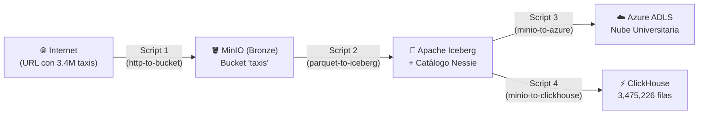

# GUÍA CONCEPTUAL COMPLETA: PROYECTO 1 - BIG DATA
## De Cero a Experto: ¿Qué estamos haciendo, por qué y cómo funciona cada pieza?

> **Para ti y tu equipo:** Este documento explica en lenguaje claro, técnico y con analogías de la vida real absolutamente todo lo que compone este proyecto. Léanlo con calma para que tengan el 100% del dominio conceptual al defender el trabajo ante el profesor.

---

## 1. El Panorama General (The Big Picture): ¿Cuál es el objetivo del proyecto?

Imaginen una empresa de taxis en Nueva York que genera millones de viajes al mes. La información de esos viajes está flotando en internet en un archivo público.
El profesor nos dijo: 
*"Muchachos, tomen esos millones de viajes de internet, constrúyanme una arquitectura moderna de datos (Data Lakehouse) en sus computadores con Docker, organicen los datos con estándares de la industria, hagan una copia en la nube de Azure y cárguenlos en una base de datos analítica sin perder ni un solo registro (exactamente 3,475,226 filas)"*.

Para lograrlo, dividimos el proyecto en **4 etapas (los 4 Notebooks)**, soportadas por **4 programas servidores (los 4 contenedores de Docker)**.



---

## 2. Glosario de Conceptos Fundamentales (Desde Cero)

### ¿Qué es eso de los "Taxis"?
No es una aplicación de taxis ni un taxi físico. Es un **dataset público masivo** publicado por la *Comisión de Taxis y Limosinas de la Ciudad de Nueva York (NYC TLC)*.
Contiene el historial de todos los viajes en taxi amarillo de NYC durante **Enero de 2025**.
Cada fila es un viaje realizado:
- Cuándo y dónde se subió el pasajero.
- Cuándo y dónde se bajó.
- Distancia recorrida.
- Tarifa cobrada, propina pagada, peajes, etc.
- **¿Cuántos viajes son en total?** Exactamente **3,475,226 registros**. Por eso el profesor exige que al final en ClickHouse dé exactamente ese número. Si da menos, perdiste datos en el camino; si da más, duplicaste datos.

---

### ¿Qué es un "Bucket" (Balde)?
En tu computador normal tú guardas archivos en **carpetas jerárquicas** (`C:\Usuarios\Documentos\archivo.txt`).
En Big Data y en la nube (AWS S3, Google Cloud Storage, MinIO) no se usan carpetas del sistema operativo tradicional; se usa **Object Storage (Almacenamiento de Objetos)**.
- Un **Bucket** (literalmente "cubeta" o "balde") es un contenedor en la nube donde tú arrojas archivos masivos ("objetos").
- No importa si le tiras 1 archivo o 10 millones de archivos; el bucket no se satura como una carpeta de Windows porque se organiza mediante llaves (`keys`) y metadatos.
- En nuestro proyecto tenemos 2 buckets en MinIO:
  1. `taxis`: Aquí cae el archivo crudo original descargado de internet (**Capa Bronze**).
  2. `warehouse`: Aquí se guardan las tablas ordenadas y versionadas de Iceberg (**Capa Silver**).

---

### ¿Qué es un archivo "Parquet"?
Seguramente conoces los archivos `.csv` o `.xlsx` (Excel). 
- Un `.csv` guarda la información en **filas de texto plano**. Si tiene 3 millones de filas, pesa 500 MB o 1 GB, y para leer la columna "propina", la computadora tiene que leer todo el archivo de principio a fin obligatoriamente.
- Un **Parquet** es un formato binario **columnar** y altamente comprimido. 
  - Si un CSV pesa 600 MB, en Parquet pesa solo 50 MB.
  - Si tú le pides a Parquet *"dame solo la columna tarifa"*, Parquet va directo a esa columna y no gasta memoria leyendo las otras 18 columnas. Es el formato rey en Big Data.

---

### ¿Qué es un "Data Lakehouse"?
- **Data Lake:** Una bodega gigante y barata donde guardas archivos crudos (imágenes, CSV, Parquet, JSON). Problema: se puede convertir en un pantano caótico ("Data Swamp") donde nadie sabe qué versión es la actual ni se pueden hacer transacciones seguras.
- **Data Warehouse:** Una base de datos estructurada, ordenada y muy rápida para hacer consultas SQL (como ClickHouse), pero cara y rígida.
- **Data Lakehouse:** Lo mejor de los dos mundos. Guardas los datos baratos en un Data Lake (MinIO), pero les pones encima una capa de inteligencia y gobierno (Apache Iceberg + Nessie) que hace que esos archivos se comporten exactamente como una base de datos relacional con tablas formales.

---

### ¿Qué es "Apache Iceberg" y qué es "Project Nessie"?
Esta es una de las preguntas fijas del parcial y del proyecto:
1. **Apache Iceberg:** Es un **Table Format** (formato de tabla). Imagina que tienes 100 archivos Parquet en un bucket. ¿Cómo sabe una consulta SQL cuáles archivos pertenecen a la tabla hoy y cuáles son versiones viejas borradas? Iceberg crea un árbol de metadatos (`metadata.json`, archivos `.avro` de manifiesto) que lleva el control milimétrico de cada archivo de datos. Permite:
   - **ACID Transactions:** Si la carga falla por la mitad, no te corrompe la tabla.
   - **Schema Evolution:** Puedes agregar o renombrar columnas sin reescribir gigabytes de datos.
   - **Time Travel:** Puedes consultar la tabla tal como estaba hace 3 días o hace 1 hora.
2. **Project Nessie:** Es el **Catálogo**. Iceberg necesita a alguien que le diga: *"Oiga, ¿dónde está el último metadato válido de la tabla `taxis`?"*. Nessie hace exactamente eso. Es como un **"Git para tus datos"**: guarda las referencias, permite crear ramas (`branches`), commits de datos y tags.
   - **El detalle de la rúbrica:** Por defecto Nessie guarda su información en la memoria RAM (`IN_MEMORY`). Si tú apagas el contenedor de Docker, Nessie olvida dónde estaban las tablas de Iceberg. Por eso configuramos **RocksDB** con un volumen de Docker, logrando que el catálogo quede grabado en el disco duro y no se pierda nada al reiniciar Docker.

---

### ¿Qué es "MinIO"?
Es una herramienta de software libre que simula exactamente el servicio **Amazon Web Services S3 (AWS S3)** pero corriendo dentro de tu propio computador en Docker. 
Todo el código que escribas para MinIO funciona idéntico si mañana lo despliegas en la nube real de Amazon.

---

### ¿Qué es "ClickHouse"?
Es una base de datos **OLAP** (Online Analytical Processing) columnar ultrarrápida. 
A diferencia de MySQL o Postgres (que son para transacciones como compras de tiendas virtuales), ClickHouse está diseñada para procesar millones de filas por segundo y responder consultas agregadas (`SUM`, `AVG`, `COUNT`) en milisegundos. Es el destino final del viaje de nuestros datos.

---

### ¿Qué es "Azure Data Lake Storage (ADLS Gen2)"?
Es el servicio de almacenamiento masivo en la nube de Microsoft Azure. El profesor creó un Data Lake real en la cuenta universitaria (`fhbd.dfs.core.windows.net`) y nos asignó credenciales para que demostremos que nuestro pipeline no solo corre en local, sino que es capaz de sincronizar datos contra la nube corporativa.

---

## 3. ¿Para qué sirve cada carpeta y cada archivo del proyecto?

### 📁 Carpeta `.dlt/`
**¿Qué es DLT?** Significa **Data Load Tool**. Es una librería de Python de última generación diseñada para construir pipelines de extracción y carga (EL / ELT). Se encarga de conectarse a fuentes, transformar datos y enviarlos a destinos (S3, Azure, bases de datos SQL) manejando esquemas automáticamente.

Dentro de `.dlt/` hay tres archivos:
1. **`secrets.toml` (El llavero secreto):**
   - **¿Qué significa?** Es donde se guardan las contraseñas, usuarios y llaves de acceso (por ejemplo, el usuario `admin` de MinIO o la `account_key` secreta de Azure).
   - **¿Por qué está separado?** Porque jamás se deben quemar (hardcodear) contraseñas dentro del código Python de los notebooks. DLT busca automáticamente este archivo al ejecutarse.
2. **`secrets.toml.example` (La plantilla pública):**
   - Es una copia idéntica del archivo anterior, pero con contraseñas falsas o marcadores como `GRUPO_X`. Este archivo **sí** se sube a GitHub para que cualquier persona que clone el repositorio sepa qué variables debe configurar.
3. **`config.toml`:**
   - Guarda configuraciones del comportamiento de DLT que no son secretas (por ejemplo: apagar el rastreo de telemetría de la librería y fijar el nivel de mensajes en pantalla a `INFO`).

---

### 📁 Carpeta `notebooks/`
Un **Jupyter Notebook** (`.ipynb`) es un entorno de trabajo interactivo donde puedes mezclar celdas de texto explicativo (como este documento) con bloques de código ejecutable de Python y ver las respuestas, tablas y gráficos inmediatamente debajo de cada celda.

En nuestro proyecto contiene los 4 scripts secuenciales que exige la rúbrica:

#### 1. `01_http_to_bucket.ipynb` (Ingesta Capa Bronze)
- **¿Qué hace?** Toma la URL pública de internet con los viajes de taxis de Enero 2025 (`yellow_tripdata_2025-01.parquet`). Con `dlt` y `fsspec`, descarga el archivo en bloques de memoria y lo sube al bucket `taxis` de nuestro MinIO local.
- **¿Por qué?** Porque en la arquitectura Medallion (Bronze/Silver/Gold), la capa Bronze es el respaldo crudo e inmutable: si el día de mañana la URL de internet se cae o se borra, ya tenemos los datos originales a salvo en nuestro propio Data Lake.

#### 2. `02_parquet_to_iceberg.ipynb` (Capa Silver con Metadatos)
- **¿Qué hace?** Va a MinIO, lee el archivo Parquet de la capa Bronze con `pyarrow`. Luego se conecta al catálogo **Nessie**, crea un espacio de nombres llamado `demo` y crea la tabla formal `demo.taxis_iceberg`. Escribe los datos en el bucket `warehouse`.
- **¿Por qué?** Porque los archivos Parquet sueltos en carpetas son propensos a desorden. Al registrarlos como tabla Iceberg bajo el gobierno de Nessie, los datos quedan protegidos con transacciones ACID, versionamiento y metadatos formales.

#### 3. `03_minio_to_azure.ipynb` (Carga a la Nube)
- **¿Qué hace?** Lee los archivos estructurados desde MinIO local y, utilizando `dlt` con las credenciales de Azure, sube una copia completa hacia el contenedor en la nube universitaria (`abfss://clase-4-dlt@fhbd.dfs.core.windows.net/GRUPO_X`).
- **¿Por qué?** Simula un escenario empresarial real donde procesas o preparas datos en tu cluster local/híbrido y luego alimentas el Data Lake central de la corporación en la nube para disponibilidad global.

#### 4. `04_minio_to_clickhouse.ipynb` (Destino Analítico y Verificación de Integridad)
- **¿Qué hace?** Lee la tabla Iceberg gobernada por Nessie y utiliza el conector nativo de `dlt` para insertar las filas en la base de datos **ClickHouse**.
- **La gran prueba de fuego (Rúbrica de 5.0):** Al final ejecuta la consulta SQL:
  ```sql
  SELECT count(*) FROM default.taxis_iceberg;
  ```
  Y debe retornar exactamente **3,475,226 filas**. Con esto demostramos matemáticamente que en todo el viaje (Internet -> MinIO -> Iceberg -> ClickHouse) no se corrompió ni se perdió un solo registro.

---

### 📄 Archivo `docker-compose.yml`
Es el "director de orquesta". En lugar de tener que instalar Python, MinIO, Nessie y ClickHouse directamente en tu Windows (lo cual causaría conflictos de versiones, problemas de Java o errores de puertos), Docker levanta **4 máquinas virtuales livianas (contenedores)** aisladas pero conectadas entre sí a través de una red virtual interna llamada `lakehouse-net`:

1. **`minio`:** Servidor S3 local (puertos 9000 para datos, 9001 para consola web).
2. **`nessie`:** Catálogo de Iceberg persistente con RocksDB (puerto 19120).
3. **`clickhouse`:** Base de datos analítica OLAP (puerto 8123 HTTP, 9000 TCP).
4. **`jupyter`:** Entorno donde abrimos los notebooks (puerto 8888).

---

### 📄 Archivo `requirements.txt`
Es la lista de compras de librerías de Python (`dlt`, `pyiceberg`, `pyarrow`, `s3fs`, `adlfs`, `clickhouse-connect`, etc.).
- **Directriz estricta del profesor:** Queda prohibido poner `!pip install pyiceberg` dentro de una celda de Jupyter. 
- Al levantar Docker, el contenedor de Jupyter lee este archivo y preinstala todo limpiamente en el arranque del sistema. Cuando tú abres el notebook, ya todo funciona sin esperas ni descargas repetitivas.

---

### 📄 Archivo `.gitignore`
Es el filtro de seguridad de Git. Le dice a GitHub qué archivos **NUNCA** deben subirse a internet:
- `.dlt/secrets.toml`: Para que nadie en internet te robe las llaves de acceso.
- `.ipynb_checkpoints/`: Archivos temporales de autoguardado de Jupyter.
- `data/` o `*.parquet`: Archivos masivos pesados que romperían el límite de peso de GitHub.

---

## 4. Resumen: ¿Cómo fluye la información en una frase?

> *"Descargamos 3.47 millones de registros de taxis de Nueva York en formato Parquet crudo a nuestro **MinIO local** (Bronze), los convertimos en una tabla inteligente y versionada de **Apache Iceberg** gobernada por el catálogo **Project Nessie** (Silver), respaldamos una copia en la nube corporativa de **Azure**, y finalmente cargamos todo en el motor analítico **ClickHouse** comprobando que no se perdió ni una sola de las 3,475,226 filas."*

---

¡Con esto ya tienes el panorama completo! Cuando quieras, procedemos a realizar el commit en Git y encender Docker para ejecutar el primer script juntos paso a paso.
