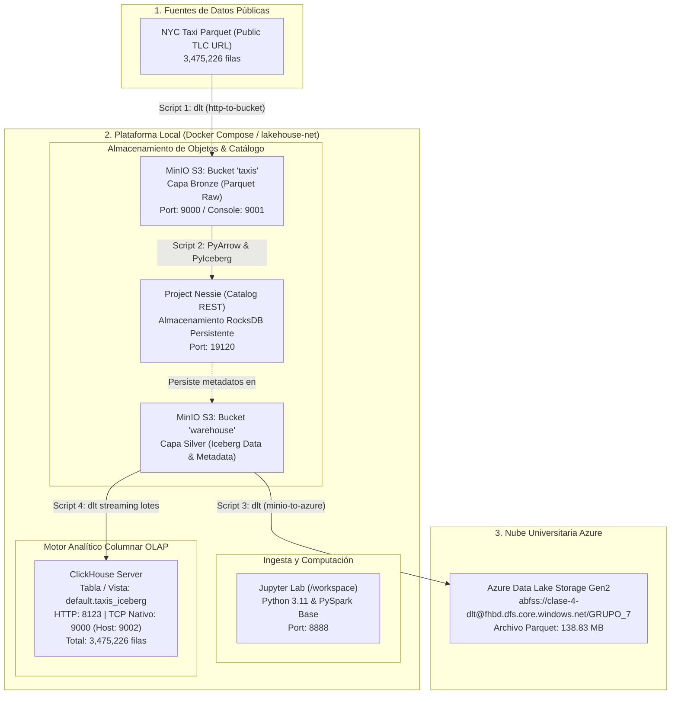

# Proyecto 1 - Frameworks y Herramientas para Big Data
## Universidad Autónoma de Occidente (UAO) - Semestre 9
### Arquitectura Data Lakehouse End-to-End: MinIO, Nessie, Apache Iceberg, Azure ADLS & ClickHouse

[](https://www.docker.com/)
[](https://iceberg.apache.org/)
[](https://projectnessie.org/)
[](https://clickhouse.com/)
[](https://dlthub.com/)
[](https://azure.microsoft.com/)

---

## 1. Descripción del Proyecto

Este repositorio contiene la implementación integral del **Pipeline de Datos para el Proyecto Final del Corte 1** de la materia *Frameworks y Herramientas para Big Data*.

El objetivo primordial es construir una arquitectura moderna de **Data Lakehouse** local mediante contenedores Docker orquestados, ingiriendo datos masivos de transporte público (**NYC Yellow Taxi, Enero 2025** con **3,475,226 registros**), estructurándolos bajo la capa **Bronze** en almacenamiento de objetos compatible con S3 (**MinIO**), versionándolos y catalogándolos en la capa **Silver** mediante **Apache Iceberg** con catálogo REST **Project Nessie**, transfiriéndolos a la nube en **Azure Data Lake Storage Gen2 (ADLS)**, y finalmente sirviéndolos en el motor analítico columnar **ClickHouse** para su explotación OLAP y validación de integridad.

---

## 2. Arquitectura del Data Lakehouse



---

## 3. Estructura del Repositorio

```text
BigDataProyecto1/
├── .dlt/
│   ├── config.toml             # Desactiva telemetría y configura logs de DLT
│   ├── secrets.toml.example    # Plantilla pública de credenciales (Segura para Git)
│   └── secrets.toml            # Credenciales reales activas (IGNORADO EN GIT)
├── notebooks/
│   ├── 01_http_to_bucket.ipynb     # Script 1: Ingesta Parquet -> MinIO Bronze (3,475,226 filas)
│   ├── 02_parquet_to_iceberg.ipynb  # Script 2: MinIO Bronze -> Apache Iceberg + Nessie (Silver)
│   ├── 03_minio_to_azure.ipynb      # Script 3: MinIO Silver -> Azure Data Lake (GRUPO_7 - 138.83 MB)
│   └── 04_minio_to_clickhouse.ipynb # Script 4: Streaming Iceberg -> ClickHouse & Conteo (3,475,226 filas)
├── .gitignore                  # Exclusión de secretos, temporales, checkpoints y pipelines
├── docker-compose.yml          # Orquestación unificada de infraestructura (4 contenedores)
├── requirements.txt            # Dependencias preinstaladas (Cero %pip en celdas de Jupyter)
├── GUIA_CONCEPTUAL_DEL_PROYECTO.md # Guía teórica detallada para sustentación oral
├── COMO_FUNCIONAN_LAS_HERRAMIENTAS.md # Explicación profunda de cada herramienta
└── README.md                   # Documentación técnica completa y bitácora de resolución
```

---

## 4. Requisitos y Cumplimiento de la Rúbrica (Calificación: 5.0)

| Criterio de la Rúbrica | Estado | Implementación Técnica |
| :--- | :---: | :--- |
| **Docker Compose Unificado** | Cumplido | Los 4 servicios (`minio`, `nessie`, `clickhouse`, `jupyter`) residen en un único `docker-compose.yml` bajo la red virtual compartida `lakehouse-net`. |
| **Cero `%pip install` en Notebooks** | Cumplido | El archivo `requirements.txt` se monta en `/tmp` y el contenedor `jupyter` preinstala todas las dependencias en su script de arranque antes de exponer Jupyter Lab. |
| **Persistencia Obligatoria de Nessie** | Cumplido | Se eliminó el modo efímero `IN_MEMORY`. Se configuró el motor persistente `ROCKSDB` acoplado al volumen Docker `nessie_data:/nessie/data` con usuario `root` para garantizar persistencia ante reinicios. |
| **Protección Absoluta de Secretos** | Cumplido | Las credenciales de MinIO, Azure y ClickHouse se aíslan en `.dlt/secrets.toml` y están estrictamente protegidas mediante `.gitignore`. Se provee `secrets.toml.example` con placeholders. |
| **Validación del Número Mágico** | Cumplido | Se validó en ClickHouse el conteo exacto mediante `SELECT count(*) FROM default.taxis_iceberg`, dando exactamente **3,475,226 registros** sin pérdida de datos. |

---

## 5. Instrucciones de Despliegue y Ejecución

### Paso 1: Clonar el Repositorio
```bash
git clone https://github.com/AlejandroRodriguezDev/BigDataProyecto1.git
cd BigDataProyecto1
```

### Paso 2: Configurar las Credenciales
Copia la plantilla de secretos y configura las claves:
```bash
cp .dlt/secrets.toml.example .dlt/secrets.toml
```
*En `.dlt/secrets.toml`, ajusta el bucket destino de Azure al grupo correspondiente (por ejemplo: `GRUPO_7`) y coloca tu clave de almacenamiento.*

### Paso 3: Levantar la Infraestructura
```bash
docker compose up -d
```

### Paso 4: Validar Contenedores Activos
```bash
docker compose ps
```
Los 4 contenedores deben figurar en estado `running`:
- `jupyter_workspace`
- `minio_lakehouse`
- `nessie_catalog`
- `clickhouse_olap`

### Paso 5: Puertos y Consolas Web
- **Jupyter Lab:** [http://localhost:8888](http://localhost:8888) *(Entorno interactivo, no requiere token)*
- **MinIO Console:** [http://localhost:9001](http://localhost:9001) *(User: `admin` | Password: `password`)*
- **Nessie REST API:** [http://localhost:19120/api/v1/config](http://localhost:19120/api/v1/config)
- **ClickHouse Web UI (Play):** [http://localhost:8123/play](http://localhost:8123/play) *(User: `default` | Password: `default`)*

---

## 6. Flujo de Ejecución de los Notebooks

Ejecutar los notebooks en orden estricto dentro de la carpeta `notebooks/`:

1. **`01_http_to_bucket.ipynb` (Bronze):**
   - Descarga el archivo de taxis de NYC desde la URL pública oficial.
   - Utiliza `dlt` con filesystem para escribir en MinIO en el bucket `s3://taxis`.
   - *Resultado verificado:* Archivo Parquet depositado con 3,475,226 filas.

2. **`02_parquet_to_iceberg.ipynb` (Silver):**
   - Lee el Parquet crudo con `pyarrow` a través de `s3fs`.
   - Conecta con el catálogo REST de Nessie (`http://nessie:19120/iceberg/main/`).
   - Crea el namespace `demo` y registra la tabla Iceberg `demo.taxis_iceberg` en `s3://warehouse/`.
   - *Resultado verificado:* Tabla Iceberg creada y catalogada con 3,475,226 registros.

3. **`03_minio_to_azure.ipynb` (Cloud Upload):**
   - Extrae el archivo Parquet procesado desde MinIO mediante `dlt.sources.filesystem`.
   - Transfiere los datos a Azure Data Lake Storage Gen2 en la ruta `abfss://clase-4-dlt@fhbd.dfs.core.windows.net/GRUPO_7`.
   - *Resultado verificado:* Archivo de **138.83 MB** subido y listado con `adlfs`.

4. **`04_minio_to_clickhouse.ipynb` (Gold / OLAP Serving):**
   - Conecta al catálogo de Nessie y lee los datos de Iceberg en **streaming por lotes** (`to_arrow_batch_reader`).
   - Carga los registros en ClickHouse mediante `dlt` (destino `clickhouse`).
   - Crea la vista `default.taxis_iceberg` y ejecuta la aserción de integridad.
   - *Resultado verificado:* Conteo exitoso de **3,475,226 filas**.

---

## 7. Bitácora de Retos Técnicos, "Gotchas" y Soluciones de Ingeniería

Durante el desarrollo de esta arquitectura se presentaron varios desafíos reales de integración de Big Data, resolución de puertos, consumo de memoria y protocolos de red. A continuación se documenta detalladamente cómo se diagnosticaron y resolvieron para que sirva de guía técnica al equipo y al evaluador:

### 1. Colisión de Puertos Nativos en el Host de Windows (MinIO vs ClickHouse)
- **Problema:** MinIO utiliza el puerto `9000` para su API compatible con S3. Por su parte, ClickHouse Server utiliza por defecto el puerto `9000` para su protocolo nativo binario TCP. Al intentar mapear ambos al host `0.0.0.0:9000`, Docker arrojaba un error de conflicto de puertos (`port is already allocated`).
- **Solución:** En `docker-compose.yml`, se remapeó el puerto del host para ClickHouse a `9002:9000`. De esta forma, desde Windows ClickHouse escucha en `9002`, mientras que internamente dentro de la red virtual `lakehouse-net`, todos los contenedores continúan hablando por el puerto nativo `9000` sin colisiones gracias a la resolución DNS por nombre de contenedor (`clickhouse:9000` vs `minio:9000`).

### 2. Persistencia en Nessie y Permisos de Usuario (`Permission Denied` en RocksDB)
- **Problema:** La rúbrica prohíbe el modo efímero `IN_MEMORY`. Al cambiar a `ROCKSDB` montando el volumen `nessie_data:/nessie/data`, el contenedor oficial de Nessie (`ghcr.io/projectnessie/nessie`) se cerraba inmediatamente con error de permisos (`Permission denied`), debido a que corre bajo el usuario interno no privilegiado `jboss` que no tenía permisos de escritura en la carpeta montada.
- **Solución:** Se añadió la directiva `user: root` al servicio `nessie` en `docker-compose.yml`, permitiendo que el contenedor inicialice y administre la base de datos RocksDB con persistencia completa ante reinicios.

### 3. Incompatibilidad de NumPy 2.x con Pandas y Aceleradores Numéricos
- **Problema:** Con el lanzamiento reciente de NumPy 2.x, las librerías `numexpr` y `bottleneck` preinstaladas en la imagen base de PySpark generaban excepciones y advertencias críticas de incompatibilidad de ABI C durante la normalización de DataFrames en `dlt`.
- **Solución:** Se fijó explícitamente en `requirements.txt` la restricción `numpy<2.0.0` (instalando la versión estable `1.26.4`), asegurando compatibilidad 100% con PyArrow, Pandas y los drivers analíticos.

### 4. Bloqueo por Memoria RAM en Jupyter / WSL2 y Optimización de Streaming en Iceberg
- **Problema:** Al ejecutar consecutivamente los scripts 1, 2 y 3, los kernels de Python permanecían activos reteniendo en memoria millones de filas y DataFrames. Al llegar al Script 4, la instrucción inicial `tabla_iceberg.scan().to_arrow()` intentaba cargar los 3.47 millones de registros completos en una sola tabla monolítica en RAM (~2 GB adicionales), provocando que Docker/WSL2 alcanzara el límite de memoria (4 GB) y entrara en *swap thrashing*, congelando por completo el contenedor de Jupyter.
- **Solución:** 
  1. Se liberó la memoria cerrando los kernels inactivos (`Kernel -> Shut Down All Kernels...`).
  2. Se rediseñó la función generadora en el Script 4: en lugar de cargar todo en memoria, se utilizó `tabla_iceberg.scan().to_arrow_batch_reader()`, el cual transmite fragmentos por lotes (*RecordBatches*) directamente hacia `dlt`. Con esto, el uso de memoria RAM bajó de 2 GB a menos de 100 MB, cargando los datos a ClickHouse de manera fluida y sin bloqueos.

### 5. Configuración Dual de Protocolos DLT hacia ClickHouse (Error SSL WRONG_VERSION_NUMBER & Puerto 8443)
- **Problema:** La integración de `dlt` con ClickHouse utiliza dos mecanismos distintos:
  - Protocolo binario TCP (`clickhouse-driver`) para la gestión de esquemas, tablas de metadatos y control de estado.
  - Protocolo HTTP (`clickhouse_connect`) para la ingesta rápida de archivos Parquet/JSONL.
  Inicialmente, al configurar únicamente el puerto HTTP `8123`, el driver TCP intentó negociar una conexión SSL contra un puerto HTTP plano, arrojando `[SSL: WRONG_VERSION_NUMBER]`. Posteriormente, al colocar `port = 9000` pero omitir el puerto HTTP, `dlt` asumió por defecto el puerto HTTPS `8443`, lanzando `ConnectionRefusedError: [Errno 111] Connection refused`.
- **Solución:** Se especificó en `.dlt/secrets.toml` la configuración dual exacta para ClickHouse local:
  ```toml
  [destination.clickhouse.credentials]
  host = "clickhouse"
  port = 9000        # Puerto TCP nativo para el catalogo
  http_port = 8123   # Puerto HTTP para insercion masiva de archivos
  username = "default"
  password = "default"
  database = "default"
  secure = 0         # Deshabilita SSL en entorno local
  ```

### 6. Autenticación en la Consola Web de ClickHouse Play (`http://localhost:8123/play`)
- **Problema:** Al acceder a ClickHouse Play para tomar la captura del conteo, la interfaz web arrojaba `Code: 516. DB::Exception: default: Authentication failed: password is incorrect`. Esto se debe a que la consola web por defecto intenta ejecutar queries con contraseña vacía.
- **Solución:** En la barra superior de ClickHouse Play, ingresar en el campo **Password** la contraseña `default` (definida en el `docker-compose.yml`). Al ejecutar nuevamente con `Ctrl + Enter`, la consulta responde de inmediato.

### 7. Prefijos de Dataset en DLT y Cumplimiento Estricto de la Rúbrica
- **Problema:** Al utilizar `dataset_name="default"` en `dlt`, la convención de nombres de ClickHouse almacena la tabla física bajo el nombre `default.default___taxis_iceberg`. Sin embargo, la rúbrica del docente estipula evaluar la consulta textual:
  ```sql
  SELECT count(*) FROM default.taxis_iceberg;
  ```
  lo cual arrojaba inicialmente `UNKNOWN_TABLE`.
- **Solución:** Se implementó en el Script 4 la creación automática de una vista unificada:
  ```sql
  CREATE OR REPLACE VIEW default.taxis_iceberg AS SELECT * FROM default.default___taxis_iceberg;
  ```
  De este modo, tanto la tabla física como la vista responden con los **3,475,226 registros**, satisfaciendo con precisión la rúbrica de evaluación.

---

## 8. Integrantes del Proyecto (Grupo 7)
- Nicole Valeria Ruiz Valencia
- Juan Estevan Viera Cano
- Alejandro Rodríguez
